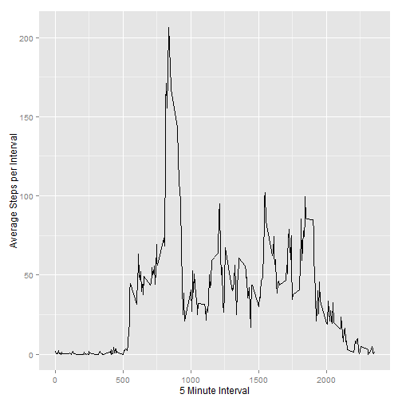
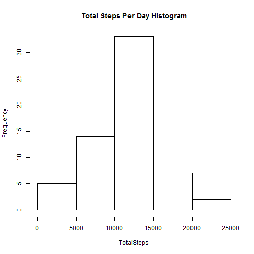

##Loading and preprocessing the data
The data is obtained from [raw data](https://d396qusza40orc.cloudfront.net/repdata%2Fdata%2Factivity.zip)

```r
if(!file.exists('activity.csv')){
    unzip('activity.zip')
}
#read in the data
indata <- read.csv("activity.csv")
#load necessary packages
library(dplyr)
library(ggplot2)
library(lattice)
library(mice)
```

##What is mean number of steps per day?
###1. Calculate the total number of steps taken per day
Group the data by date.
Then obtain the sum for each column.
Create a histogram for the steps column.
Finally, get the mean and the median for steps taken by date.  

```r
groupDateData <- group_by(indata, date) %>% summarise_each("sum")
```
###2. If you do not understand the difference between a histogram and a barplot, research the difference between them. Make a histogram of the total number of steps taken each day

```r
hist(groupDateData$steps, xlab = "TotalSteps", main = "Total Steps Per Day Histogram")
```

 

```r
#comment
```

###3. Calculate and report the mean and median of the total number of steps taken per day

```r
myMean<-mean(groupDateData$steps, na.rm = T)
myMedian<-median(groupDateData$steps, na.rm = T)
#print without scientific notation
options("scipen"=100, "digits"=4)
```

The mean number of steps taken per day is 10766.1887.  
The median number of steps taken per day is 10765.  

##What is the daily activity pattern?
###1. Make a time series plot (i.e. type = "l") of the 5-minute interval (x-axis) and the average number of steps taken, averaged across all days (y-axis)

```r
gi <- group_by(indata, interval)
agSteps <- aggregate(steps ~ interval, gi, mean)
graph2 <- qplot(interval, steps, data = agSteps, geom = "line", xlab = "5 Minute Interval", ylab = "Average Steps per Interval")
graph2
```

 

```r
#
```
###2. Which 5-minute interval, on average across all the days in the dataset, contains the maximum number of steps?

```r
maxInterval <- agSteps[which.max(agSteps$steps),]$interval
```
The 5-minute interval, on average across all the days in the dataset, that contains the maximum number of steps is 835.

##Imputing missing values
###1. Calculate and report the total number of missing values in the dataset (i.e. the total number of rows with NAs)

```r
totalNA <- sum(is.na(indata$steps))
```
###2. Devise a strategy for filling in all of the missing values in the dataset. The strategy does not need to be sophisticated. For example, you could use the mean/median for that day, or the mean for that 5-minute interval, etc.
Use the mice function from the mice package to impute the missing values. Use the predictive mean matching (pmm) method 5 times with a seed of 200.

```r
tmpData <- mice(data = indata, m =5, method = "pmm", seed = 200)
```

```
## 
##  iter imp variable
##   1   1  steps
##   1   2  steps
##   1   3  steps
##   1   4  steps
##   1   5  steps
##   2   1  steps
##   2   2  steps
##   2   3  steps
##   2   4  steps
##   2   5  steps
##   3   1  steps
##   3   2  steps
##   3   3  steps
##   3   4  steps
##   3   5  steps
##   4   1  steps
##   4   2  steps
##   4   3  steps
##   4   4  steps
##   4   5  steps
##   5   1  steps
##   5   2  steps
##   5   3  steps
##   5   4  steps
##   5   5  steps
```

```r
completed <- complete(tmpData,1)
```
###3. Create a new dataset that is equal to the original dataset but with the missing data filled in.

```r
gi2 <- group_by(completed, date)
agSteps2 <- aggregate(steps ~ date, gi2, sum)
```
###4. Make a histogram of the total number of steps taken each day and Calculate and report the mean and median total number of steps taken per day. Do these values differ from the estimates from the first part of the assignment? What is the impact of imputing missing data on the estimates of the total daily number of steps?

```r
hist(agSteps2$steps, xlab = "TotalSteps", main = "Total Steps Per Day Histogram")
```

 

```r
myMean2 <- mean(agSteps2$steps)
myMedian2 <- median(agSteps2$steps)
```

The total number of missing values in the dataset is 2304.  
The mean number of steps taken per day is 11015.  
The median number of steps taken per day is 11162.  

##Are there differences in activity patterns between weekdays and weekends?


```r
#change to date object
indata$date <- as.Date(indata$date)
indata$dow <- weekdays(indata$date)

weekendfn <- function(x) {
    wknd <- "weekday"
    if (x == "Saturday" || x == "Sunday") {
        wknd <- "weekend"
    }
    indata$wknd <<- wknd
}
indata$wknd <- sapply(indata$dow, weekendfn)
stepTotal <- aggregate(steps ~ interval + wknd, data = indata, mean)
xyplot(steps ~ interval | wknd, stepTotal, type = "l", layout = c(1,2),xlab = "Interval", ylab = "Number of steps")
```

 
